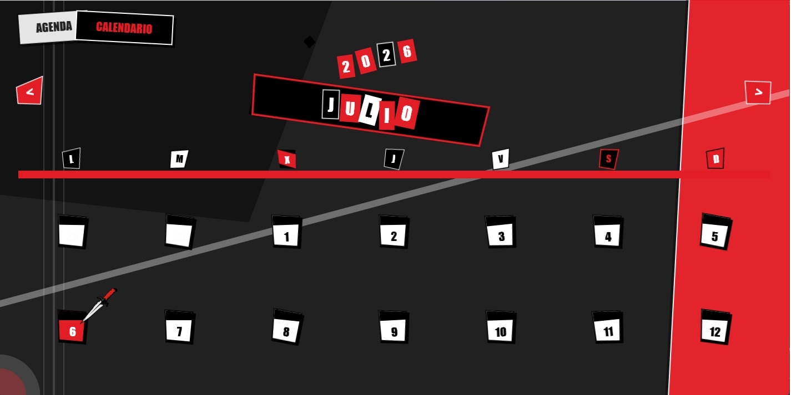
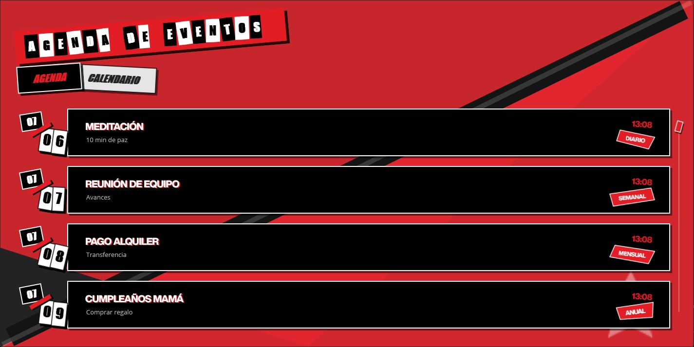

# 🎭 MauiTime — Persona 5 Stylized Calendar & Agenda


**MauiTime** es una aplicación de productividad (Agenda y Calendario) desarrollada en **.NET MAUI** que rompe por completo con las interfaces planas y aburridas del software tradicional. Inspirada al 100% en la estética tipográfica, asimétrica y de alto contraste de los menús de _Persona 5 (Atlus)_, cada transición, clic e impacto de pantalla está diseñado como una obra de arte fanzine punk.

---

## 🎬 Demostración en Acción

https://github.com/user-attachments/assets/9097949b-bd84-4f0f-8932-890c3dd16a58

---

## 🎭 Características Visuales Destacadas

### 1. Transición de Patrullaje "Target Lock"

Antes de entrar al calendario, una linterna cinemática barre de forma nerviosa la oscuridad buscando el día actual. Al fijar el objetivo, la pantalla explota con **28 cuchillas poligonales dinámicas anime** y un efecto de sacudida (_vibración sísmica desglosada_) que te expulsa directamente a la matriz de días.

### 2. Matriz de Calendario Asimétrica y Clavada de Puñal

- **Letras Ransom Dinámicas:** El mes y el año se recortan e inyectan con variaciones caóticas de tamaño, rotación y color imitando una nota de rescate.
- **Machetazo de Impacto:** Al cargar, un puñal transparente cae desde el cielo en trayectoria nítida diagonal y se empotra contra la fecha actual, haciendo estallar una elipse de impacto con un muelle elástico (`SpringOut`) y tiñendo la tarjeta en rojo fuego.
- **Sismo de Inercia:** La cuadrícula completa sufre un único latigazo sísmico seco procesado directamente en la GPU mediante animaciones nativas compuestas.

<p align="center">
  
</p>

### 3. Agenda de Eventos Fluida (Bypass de Carga)

Un tablón de anuncios duotono optimizado que elude los fallos de renderizado en frío de Windows. Las tarjetas se vacían y rellenan a través de hilos visuales aislados (`MainThread`), mostrando tus eventos mock de forma instantánea al iniciar la app.

- **Pestañas Reactivas:** Al pasar el ratón por encima de las pestañas ("AGENDA" / "CALENDARIO"), estas reaccionan saltando al frente con un efecto de muelle elástico exagerado y alterando su profundidad visual (`ZIndex`).

<p align="center">
  
</p>

---

## 🛠️ Arquitectura Técnica Avanzada

Para lograr que esta interfaz tan pesada a nivel gráfico rinda a **60fps/120fps limpios** en equipos de escritorio de baja gama sin parones (_freezeos_) ni pantallas blancas, el código se ha blindado con soluciones arquitectónicas avanzadas:

- **Desacoplamiento por Tokens Únicos (`Guid`):** La animación del cuchillo implementa firmas de identidad efímeras. Si los eventos nativos de Windows disparan renderizados duplicados en cascada, las ejecuciones fantasmas se auto-destruyen en milisegundos evitando "ecos" visuales.
- **Animaciones Compuestas en GPU:** El sismo general del calendario no encadena comandos asíncronos secuenciales. En su lugar, se empaqueta en una clase estructural `Animation` nativa que procesa la ida y la vuelta de forma continua en la tarjeta gráfica.
- **Ciclo de Vida Reactivo Puro:** El color y texto del día actual se alteran a través de bindings y propiedades de la interfaz `INotifyPropertyChanged`, impidiendo que el `CollectionView` destruya y reconstruya los controles en tiempo de ejecución.

---

## 🗺️ Infiltration Route (Roadmap de Desarrollo)

El asalto a la interfaz no ha terminado. Estas son las características planeadas que se están implementando activamente:

- [x] Coreografía cinemática "Target Lock" y sacudida de GPU fluida.
- [x] Inyección dinámica de tipografías Ransom estilo nota de rescate.
- [x] Doble sismo unificado y elipse elástica de impacto para el día actual.
- [ ] **Módulo de Navegación de Meses:** Transición de recortes con efectos cortantes al pulsar `<` o `>`.
- [ ] **Persistencia Local:** Integración de base de datos SQLite para guardar eventos reales de la Agenda de forma permanente.
- [ ] **Efectos de Sonido HUD:** Inclusión de efectos de audio de baja fidelidad en clics y transiciones críticas.

---

## 💻 Requisitos e Instalación

1. Asegúrate de tener instalado el SDK de **.NET 10** y la carga de trabajo de **.NET MAUI**.
2. Clona este repositorio en tu equipo:
   ```bash
   git clone https://github.com
   ```
3. Abre la solución con **Visual Studio (Windows)**.
4. Selecciona el framework de destino `net10.0-windows10.0.19041.0` (Arquitectura x64).
5. Ejecuta la solución y... _¡Disfruta del espectáculo!_ 🎭

---

## 📝 Créditos y Licencia

Diseño conceptual e interfaz de usuario inspirados en la obra maestra **Persona 5** propiedad de **Atlus / Sega**. Desarrollado con fines educativos y de demostración técnica de capacidades de UI complejas en .NET MAUI.
